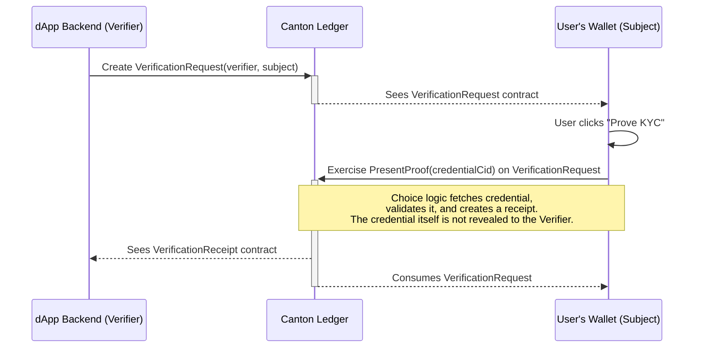

# Verifier Integration Guide: Canton Shielded Identity

Welcome to the Canton Shielded Identity Verifier Guide. This document provides everything you need to integrate our privacy-preserving KYC solution into your Canton-based dApp.

By using Shielded Identity, you can onboard users who have already been verified by a trusted institution, without ever handling their sensitive personal data. This reduces user friction, lowers your compliance overhead, and builds user trust.

## Core Concepts

*   **Verifier:** Your dApp or service. You need to verify that a user has completed KYC before allowing them to access certain features.
*   **Subject:** The end-user interacting with your dApp. They hold a shielded KYC credential.
*   **Issuer:** A trusted institution (e.g., a bank) that performs the initial KYC/AML check and issues the on-ledger credential to the Subject.
*   **Shielded Credential:** A Daml contract held by the Subject, which is not directly visible to you. Its existence can be proven without revealing its contents or its issuer.
*   **Verification Receipt:** A Daml contract that serves as proof that a specific Subject has successfully presented their credential to a specific Verifier. This is the contract your dApp will look for.

## The Verification Workflow

The process is designed to be simple and non-intrusive. It involves a three-step dance between your dApp's backend, the user's wallet, and the Canton ledger.



### Step 1: Request Verification

When a user attempts to access a feature in your dApp that requires KYC, your backend creates a `VerificationRequest` contract. This contract acts as an invitation for the user to prove their KYC status.

**From your dApp's Daml backend or trigger:**

```daml
-- In a script or trigger acting as the Verifier
module MyDapp.Onboarding where

import Daml.Script
import ShieldedIdentity.Verification.Request qualified as Request

-- | verifierParty: Your dApp's party ID
-- | subjectParty: The user's party ID
createVerificationRequest: Party -> Party -> Script (ContractId Request.T)
createVerificationRequest verifierParty subjectParty = do
  submit verifierParty do
    createCmd Request.T with
      verifier = verifierParty
      subject = subjectParty
```

This contract is signed by your dApp (`verifier`) and is visible to the `subject`.

### Step 2: User Presents Proof

The user's CIP-0103 compliant wallet will automatically detect the `VerificationRequest`. The user will see a prompt in their wallet asking for permission to prove their KYC status to your application.

Upon approval, the wallet exercises the `PresentProof` choice on the `VerificationRequest`. This is the core of the zero-knowledge interaction. The user provides their `KycCredential` contract ID to the choice. The choice logic, running atomically on the Canton ledger, does the following:
1.  Fetches the user's `KycCredential`.
2.  Asserts that the credential is valid (not expired, not revoked).
3.  Asserts that the owner of the credential is the `subject` of the request.
4.  If all checks pass, it archives the `VerificationRequest` and creates a `VerificationReceipt`.

Crucially, as the Verifier, your party does not gain visibility into the `KycCredential` contract itself. You only see the final result: the `VerificationReceipt`.

### Step 3: Confirm Receipt and Grant Access

Your dApp can now confirm that the user is verified by looking for an active `VerificationReceipt` contract. You can query the ledger for a receipt where the `verifier` is your dApp and the `subject` is the user.

A common pattern is to require the `ContractId` of the receipt as an argument to choices that control access to sensitive features.

```daml
-- In your dApp's main contract module
module MyDapp.Asset where

import ShieldedIdentity.Verification.Receipt qualified as Receipt

template Token
  with
    owner: Party
    issuer: Party
    -- other fields
  where
    signatory issuer, owner

    -- This choice is gated by a valid KYC receipt
    choice TransferToVerified : ContractId Token
      with
        newOwner: Party
        receiptCid: ContractId Receipt.T
      controller owner
      do
        -- Fetch the receipt to ensure it's valid for the newOwner
        receipt <- fetch receiptCid
        assertMsg "New owner must be KYC-verified with this platform"
          (receipt.verifier == issuer && receipt.subject == newOwner)

        create this with owner = newOwner
```

The presence of this active contract is the definitive proof of KYC. Your application can grant access to the restricted feature.

## Handling Credential Revocation

The Canton Shielded Identity model has built-in support for credential revocation. If an Issuer revokes a user's underlying `KycCredential`, the system ensures that any `VerificationReceipt` derived from it is also invalidated.

This is handled by a choice on the `KycCredential` template that, when exercised by the Issuer, archives the credential and creates a `RevocationProof`. The `VerificationReceipt` template includes a non-consuming choice `CheckRevocation` that your dApp can call. This choice attempts to find a corresponding `RevocationProof` contract for the original credential.

Your dApp's automation (e.g., a Canton Trigger) should periodically run `CheckRevocation` on active `VerificationReceipt` contracts to ensure they remain valid. If a credential has been revoked, the choice will archive the `VerificationReceipt`, automatically and atomically revoking the user's access to your dApp's gated features.

## Frontend & UI Integration

Your frontend application will typically interact with a JSON API layer that communicates with the Canton ledger.

1.  **Check Status:** When a user connects their wallet, query your backend to see if a `VerificationReceipt` already exists for their party ID and your dApp's verifier ID.
    *   **If YES:** Display a "Verified" status.
    *   **If NO:** Display a "Verification Required" button.
2.  **Initiate Verification:** When the user clicks the verification button, your frontend calls an endpoint that triggers the creation of the `VerificationRequest` contract on the ledger (Step 1).
3.  **Poll for Result:** After creating the request, your frontend should poll your backend (or use a WebSocket/stream) to wait for the corresponding `VerificationReceipt` to appear on the ledger.
4.  **Update UI:** Once the receipt is detected, update the UI to "Verified" and unlock the relevant features.

## FAQ

**Q: Do I ever see the user's name, date of birth, or other PII?**
A: No. The entire system is designed so that you, the Verifier, learn only one fact: that a trusted Issuer has successfully verified this user according to a specific standard. You never see the underlying personal data.

**Q: Which institutions can be Issuers?**
A: The list of trusted Issuers is managed at the network or application level. The model can be configured so your dApp only accepts proofs derived from credentials issued by a specific, allow-listed set of trusted parties.

**Q: What happens if a user's `VerificationRequest` is never acted upon?**
A: The `VerificationRequest` is a standing invitation. It remains on the ledger until the user either accepts it (by exercising `PresentProof`) or you decide to archive it. It has no built-in expiry.

**Q: Can a `VerificationReceipt` be transferred?**
A: No. The `VerificationReceipt` is tied specifically to your dApp's `verifier` party and the user's `subject` party. It is non-transferable and cannot be used to prove identity to another dApp. Each Verifier must issue their own `VerificationRequest`.